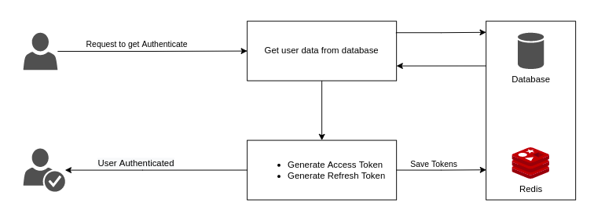

# Nodejs-Refresh-Token

## Description

Welcome to my Nodejs-Refresh-Token starter kit for building applications with user authentication and token management features. My starter kit includes a set of pre-built code that you can use as a starting point for building your own application. It includes user authentication functionality, a database for storing user data, and refresh token management features to improve the security of your application.

With my starter kit, you can quickly and easily build secure and scalable Node.js applications with minimal setup and configuration. You can customize the code to fit your specific use case and security requirements, and add new features and functionalities as needed.

My starter kit includes the following features and benefits:

    User authentication: My starter kit includes pre-built code for user authentication, including login, registration, and password reset functionality.

    Database integration: My starter kit includes a database for storing user data, with support for popular databases such as MySQL, PostgreSQL.

    Refresh token management: My starter kit includes refresh token management features, with support for rotating refresh tokens to improve the security of your authentication system.

    Customizable configuration: My starter kit includes a range of customizable configuration options, such as token expiration times, token secret keys, and database settings. This allows you to tailor the code to your specific use case and security requirements.

I hope that my starter kit can help simplify the process of building Node.js applications with authentication and token management features, and provide a solid foundation for your application development. Please feel free to use and customize the code, and share your feedback and contributions to the repository.

# High Level Architecture

Figure 1 represents the authentication architecture of this sample implementation. The architecture is comprised of two logical components; application user, and application services.

Figure 1: High Level Architecture

## Dependencies

- Node v14.15.1 (LTS) or more recent. While older versions can work it is advisable to keep node to latest LTS version

- npm 6.14.8 (LTS) or more recent, Yarn can work but was not tested for this project

## Code Styles

This project uses `eslint` and `prettier`. all configurations for this project inside `package.json` file.

## Installation

### Database setup

**[1]** Open postgres terminal with: `psql postgres`

1- `CREATE DATABASE authentication;`

2- `CREATE ROLE admin WITH PASSWORD 'admin';`

3- `ALTER ROLE admin WITH SUPERUSER CREATEROLE CREATEDB LOGIN;`

4- `GRANT ALL PRIVILEGES ON DATABASE authentication TO admin;`

**[2]** Second to install the node_modules run `npm install` or `yarn`. After installation is done start the api in dev mode with `npm run dev` or `yarn dev`.

## Unit Tests

Unit test available using Jasmine with this command: `npm run test`

## Available Scripts

In the project directory, you can run:

##### `npm run dev` or `yarn dev`

Runs the app in the development mode.
The page will reload automatically if you make edits.

##### `npm run format` or `yarn format`

Will format by prettier and will also see if any lint errors in the console.

##### `npm run test` or `yarn test`

Launches the test runner in the interactive watch mode.
See the section about running tests for more information.

##### `npm run build` or `yarn build`

Builds the app for production to the dist folder.
It's format TypeScript to JavaScript

##### `npm run start` or `yarn start`

Build and runs the app in the clients mode.
Open <http://localhost:3000/> to view it in the browser.

## Built With

- [Node](https://nodejs.org) - Javascript runtime
- [Express](https://expressjs.com/) - Javascript API framework
- [PostgreSQL](https://www.postgresql.org/) - Open source Relational Database
- [Redis](https://redis.io/) - Open source in-memory data store.
- [Jasmine](https://jasmine.github.io/) - Testing library
- [JWT](https://jwt.io/) - JSON Web Token for generates access and refresh tokens
